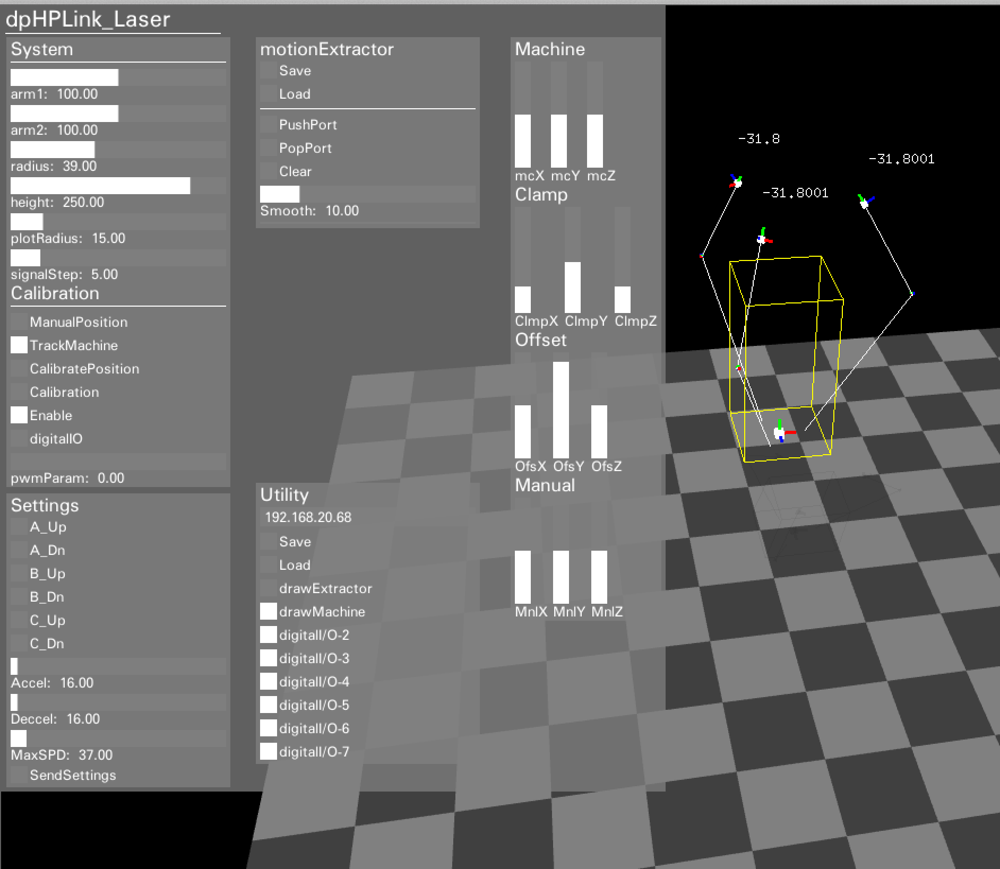

#ParallelLink

パラレルリンクのオペレーション方法です。
プログラムはappDividualPlays/2015_MAIN_APP内のプロジェクトを実行してdpH__PLink_Laser/Oil/Prismシーンでコントロール可能(各シーンでIPアドレスが異なっています)

#キャリブレーション
##電源投入
ACアダプタを差すと電源が投入されます。
電源投入時、パラレルリンクアームは**現在位置を把握していません。**

このまま制御しようとすると、思わぬ方向にアームが駆動し、アーム本体や周辺の物を傷つける可能性があるので注意してください。

##初期化
まず、GUI上で以下の手順を行います。

###Enableボタンを無効にする
一時的にアームへの制御信号をオフにします。

###CalibratePositionチェックを有効にする
シミュレータ上のアームが、3箇所とも水平になる位置に移動します。画面にシミュレータが表示されない場合は、Utilityパネルの”drawMachine”チェックを確認してください。

###Calibrationボタンを押下する
一瞬アームの励磁トルクが解け、再び固まります。
モータードライバの設定が行われ、初期位置がリセットされます。

###位置校正
Enableボタンを再びオンにした後、SettingパネルのA-Up〜C-Dnボタンでアームの位置をシミュレータと同じ位置に合わせていきます。

位置合わせが終わったら、CalibratePositionボタンをオフにして元の位置に戻します。

##MOTIONERとの連携
パラレルリンクのシーンでは、motionExtractorのポート0が中心位置、ポート1がターゲット位置になるように設定されています。
最も標準的な例として、0番ポートをアクターの腰、1番ポートをアクターの手に設定する事で、アクターは手でアームを制御できるようになります。