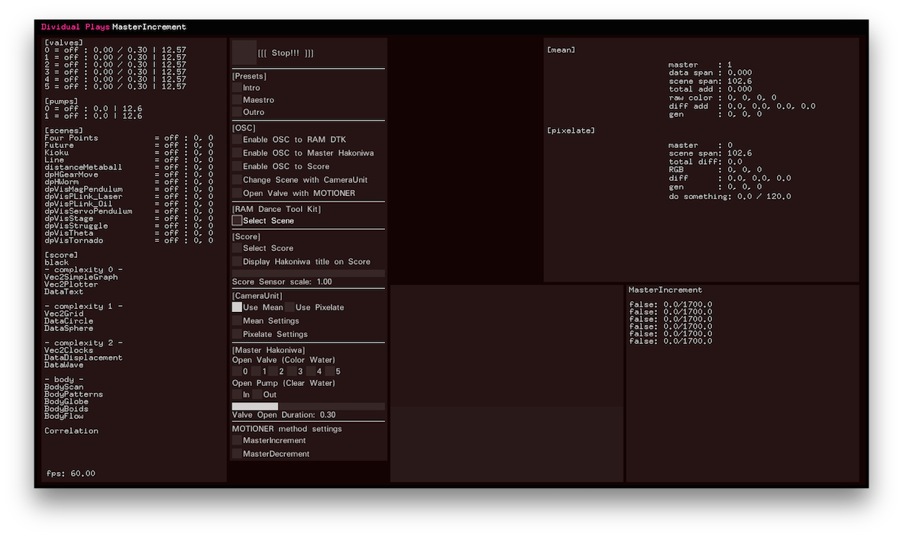

# Dividual Plays Score/MasterHakoniwa

## ビルド
Xcodeのスキームから選択。

# dpMasterHakoniwa.app

## OSC入力

**port**: 10000

#### MOTIONERから
**/ram/skeleton**: MOTIONERのデータ。フォーマットはMOTIONER参照。

#### CameraUnitから
**/dp/cameraUnit/pixelate/r**: フォーマットはCameraUnit参照。

**/dp/cameraUnit/pixelate/g**: フォーマットはCameraUnit参照。

**/dp/cameraUnit/pixelate/b**: フォーマットはCameraUnit参照。

**/dp/cameraUnit/mean**: フォーマットはCameraUnit参照。

## OSC出力

#### スコアへ

**host**: 192.168.20.11

**port**: 10000

**/dp/score/changeScene**: (string)シーン名, (string:optional)箱庭名0, (string:optional)箱庭名1

**/dp/score/sensorScale**: (float)CameraUnitのVectorデータのスケール

#### RDTKへ(CameraUnit経由)

**host**: 192.168.20.5

**port**: 12400

**/ram/set_scene**: (string)シーン名, (int)シーンオンオフ, (int)スクリーン0オンオフ, (int)スクリーン1オンオフ

**/ram/do_something**: i:乱数

#### MasterHakoniwaへ

**host**: 192.168.20.60

**port**: 8528

**/dp/hakoniwa/colorOfWater/(ピン番号)**: (int)ピンオンオフ

## Log

### [valves]
各色水バルブのステータス。

**[バルブNo.] = [on/off] : [開いている時間] / [自動で閉じる時間] | [閉じた状態の経過時間]**

### [pumps]
各換水用ポンプのステータス。
(0=in, 1=out)

**[ポンプNo.] = [on/off] : [開いている時間] / [閉じた状態の経過時間]**

### [scenes]

マスター箱庭によって選択されるシーン名。xmlファイルから読み込み。

- **マゼンタ**: 現在選択されているシーン。

- **白**: まだ選択されていないシーン。

- **グレー**: 選択済みのシーン。

**[シーン名] = [on/off] : [スクリーン0のon/off], [スクリーン1のon/off]**

### [score]
マスター箱庭によって選択されるシーン名。xmlファイルから読み込み。

- **マゼンタ**: 現在選択されているシーン。

- **白**: まだ選択されていないシーン。

- **グレー**: 選択済みのシーン。

**blak**: 暗転。RDTKのKiokuシーン時、待機時に表示される。

**complexity**: xmlファイル内でグループ分けされたScoreの複雑度合い。
複雑度0からひとつ、複雑度1からひとつ...といった具合に各複雑度からひとつ順番に選択されていく。

**body**: CameraUnitの解析が動いていないRDTKのシーンの場合はこの中から選択される。xmlファイルから読み出し。

**Correlation**: DividualPlays系統図。マニュアルで表示。

# GUI

### [[[ Stop!!! ]]]
緊急停止。色水、換水を停止して全てのOSCをオフにする。

### [mean]
**master**: アクティブな解析方法かどうか。

**data span**: CameraUnitからのOSC受信間隔。

**scene span**: 現在のシーンが選択されてからの経過時間。

**total add**: 明度の差分の蓄積。シーン切り替えでリセット。GUIから閾値を設定可能。			
**raw color**: CameraUnitから受信したデータ。

**diff add**: 各色の明度の差分の蓄積。

**gen**: 生成されたランダム情報。

**[シーン番号(残されたシーンの数でモジュロされる)], [スクリーン0のオンオフ], [スクリーン1のオンオフ]**

### [pixelate]
**master**: アクティブな解析方法かどうか。

**scene span**: 現在のシーンが選択されてからの経過時間。

**total diff**: 各色の数の差分の蓄積。

**RGB**: CameraUnitから受信したデータ。

**diff**: 差分。

**gen**: 生成されたランダム情報。

**[シーン番号(残されたシーンの数でモジュロされる)], [スクリーン0のオンオフ], [スクリーン1のオンオフ]
do something: [差分], [閾値]**

### [MasterIncrement]
現在の運動量の合計が閾値を超えたら色水のバルブが開く。

**[onoff]: [現在の運動量の合計]/[閾値]**

### [Presets]
**Intro**: 冒頭用。

**Maestro**: 全機能オン。

**Outro**: 終盤用。

### [OSC]
**Enable OSC to RAM DTK**: RAM DTKのシーンの切り替え用OSC送信のオンオフ。（CameraUnit経由）

**Enable OSC to Master Hakoniwa**: 色水箱庭へのOSCの送信オンオフ。

**Enable OSC to Score**: スコアへのOSCの送信オンオフ。シーン切り替え、スレッショルド設定。

**Change Scene with CameraUnit**: CameraUnitのデータを利用してRAM DTKとスコアのシーンを切り替える。
実際のOSCの送信は各OSCの送信機能を有効にする必要あり。

**Open Valve with MOTIONER**: MOTIONERのデータを利用して色水バルブを開閉する。
実際のOSCの送信は各OSCの送信機能を有効にする必要あり。

### [RAM Dance Tool Kit]
**Select Scene**: シーンを切り替える。実際のOSCの送信はRAM DTKのOSC送信機能を有効にする必要あり。

### [Score]
**Select Score**: シーンを切り替える。
実際のOSCの送信はScoreのOSC送信機能を有効にする必要あり。

**Display Hakoniwa Title on Score**: Scoreの切り替え時に現在の箱庭名を表示する。

**Score Sensor Scale**: スコアが受診しているCameraUnitのセンサーの値をスケーリング。

### [CameraUnit]
**Use Mean or Use Pixelate**: メインのロジックにCameraUnitのどちらの解析手段を利用するか選択。
Pixelateは非アクティブ時はDo Somethingを送信する。

**Mean Settings:Limit**: シーンが切り替わる閾値。明度の差分が蓄積。

**Mean Settings:Min Time**: シーンの切り替えに要する最低の時間。

**Pixelate Settings:Limit**: シーンが切り替わる閾値。各色の数の差分が蓄積。

**Pixelate Settings:Min Time**: シーンの切り替えに要する最低の時間。

**Pixelate Settings:Do Something Limit**: Do Somethingを送信する際の閾値。

**Pixelate Settings:Do Something**: 手動でDo Somethingを送信。

**Pixelate Settings:Enable Do Something**: Do SomethingのOSC送信をオンオフ。

### [Master Hakoniwa]
**Open Valve (Color Water)**: 0~5番までの各色のバルブを手動で開閉。バルブは一定時間後に自動で閉じる。
実際のOSCの送信はMaster HakoniwaのOSC送信機能を有効にする必要あり。

**Open Pump (Clear Water)**: 換水用ポンプをオンオフ。Inは入水。Outは排水。
実際のOSCの送信はMaster HakoniwaのOSC送信機能を有効にする必要あり。

**Valve Open Duration**: 色水のバルブが自動で閉じる時間。

### [MOTIONER Method Settings]
**MasterIncrement:Dist Limit**: MOTIONERの運動量が蓄積していき色水のバルブが開く際の閾値。

**MasterIncrement:Do Something**: 未実装

## XML
**rdk:phase:scene name=***マスター箱庭に選択されるシーン名*

**rdk:nocam:scene name=***CameraUnitの解析がないシーン*

**rdk:alloff:scene name=***すべてのディスプレイをオフにするシーン*

**score:complexity***Scoreの表現の複雑度合いによりグループ分け*

**score:complexity:scene name=***マスター箱庭に選択されるシーン名*

**score:body:scene name=***CameraUnitの解析がないRDTKのシーンが選択された時にマスター箱庭に選択されるシーン*

**score:correlation:scene name=***樹形図シーン*

# dpScore.app

## OSC入力

**port**: 10000

#### マスター箱庭から
**/dp/score/changeScene**: (string)シーン名, (string:optional)箱庭名0, (string:optional)箱庭名1

**/dp/score/sensorScale**: (float)CameraUnitのVectorデータのスケール

#### MOTIONERから
**/ram/skeleton**: MOTIONERのデータ。フォーマットはMOTIONER参照。

#### CameraUnitから
**/dp/cameraUnit/vector**: フォーマットはCameraUnit参照。

**/dp/cameraUnit/vector/total**: フォーマットはCameraUnit参照。

## XML

**data/settings/master_hakoniwa_settings.xml**

**SceneCorrelation**: 樹形図に表示される箱庭名はXMLファイルから読み込み。

## キーバインド

**escape**: 終了

**F**: フルスクリーン

**G**: GUI表示

**C**: カーソル表示

**/**: FPS表示

**I**: 反転

**D**: CameraUnitのVectorをシミュレート

**S**: GUIの設定を保存

**→**: 次のシーン

**←**: 前のシーン

**↑**: CameraUnitのVectorデータを拡大

**↓**: CameraUnitのVectorデータを縮小

## GUI

**Global Sensor Scale**: CameraUnitのVectorデータをスケーリング

**Change Scene**: シーン切り替え 

**Debug CameraUnit**: CameraUnitのVectorをシミュレート

**Invert**: 反転

**Show FPS**: FPS表示

**Show Cursor**: カーソル表示

**Fullscreen**: フルスクリーン